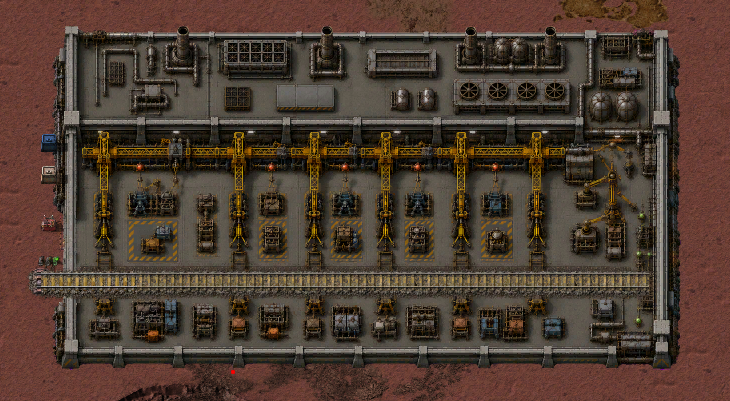
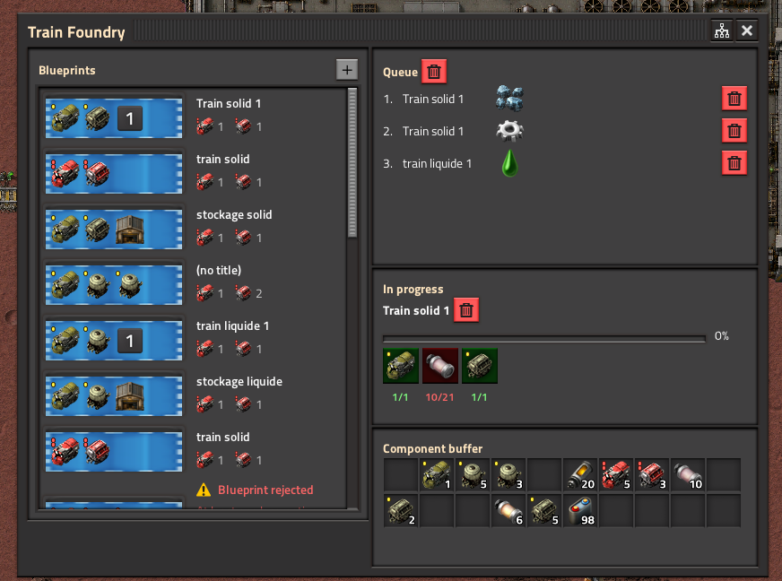
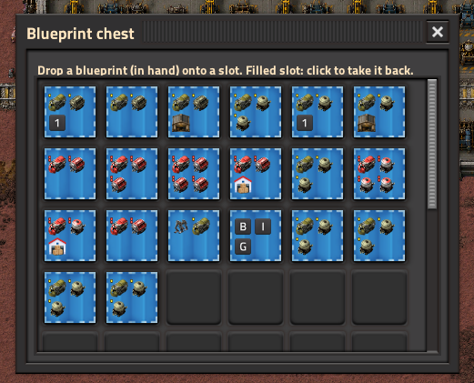
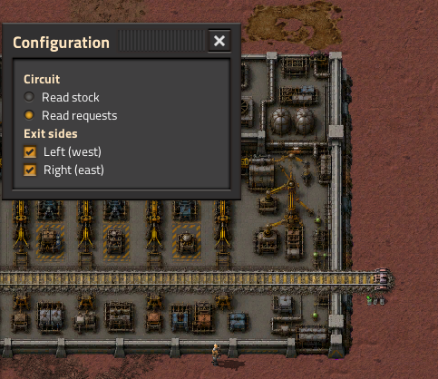
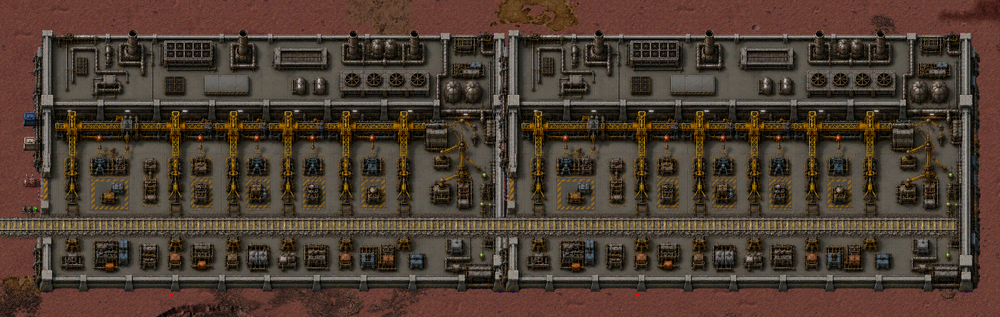

# Train Foundry

A Factorio 2.0 / 2.1 mod. Build complete trains from blueprint templates instead
of placing every locomotive and wagon by hand.

A large foundry building sits on the end of one of your rail lines. Import a
train blueprint, queue it, and the foundry assembles the whole train and sends it
off onto your network on its own — composition, orientation, colors, fuel,
schedule, train group and blueprint parameters included.

## How it works

- **Place it anywhere buildable** — the foundry lays its own exit track; just
  connect your network to it afterwards.
- **Drop blueprints in the blue chest** on the west apron (by hand or with
  inserters); the window lists them. The blueprint must contain only the train.

  

- **Queue trains** — click a template; blueprint parameters are asked once.
- **Feed the parts** — locomotives, wagons, fuel, ammo and equipment-grid gear
  come from the foundry's internal stock; fill it by hand or with inserters.
- **Choose the exit side** — left (west) by default; open the Configuration
  window (panel button in the title bar) to open the right (east) exit too. The
  train takes whichever open side its schedule leads to.

  

- Built trains **drive off** with their schedule, group, fuel and equipment set.

## Longer trains

Place another Train Foundry against the east side of an existing one to chain it
as an **extension**: the track and capacity extend across the whole hall (+5
vehicles per module). The chain is driven from a single window.

## Extras

- **Circuit network** — wire the connector and pick, in the Configuration window,
  whether to broadcast the internal stock or the missing components.
- **Remote control** — a shortcut-bar button (or `CTRL+ALT+F`) opens the
  foundry's window from anywhere. One foundry (chain) per planet.
- Compatible with vanilla, Space Age and Nullius.

## Building from source

`./build.sh package` produces the Factorio 2.0 zip and the 2.1 zip from the same
source. `./build.sh link` symlinks the repo into `~/.factorio/mods` for
development.

## License

MIT — see [LICENSE](LICENSE).
